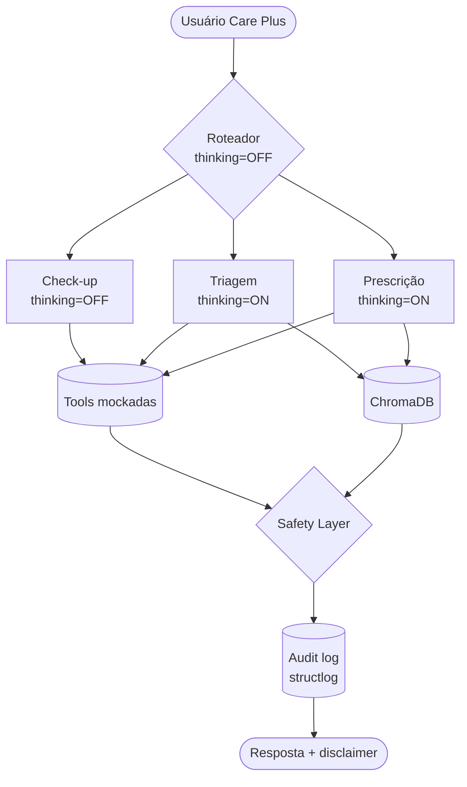

# BluaDiagnostics

> **Assistente clínico digital da Care Plus** — chatbot multi-agente em
> Português Brasileiro nativo, integrado ao app Blua, que apoia triagem
> conversacional de sintomas e prescrição remota assistida (sempre com
> aprovação médica humana). Sprint 1 de PoC acadêmica FIAP.

## Integrantes

- [Nome — RM XXXXX]
- [Nome — RM XXXXX]
- [Nome — RM XXXXX]
- [Nome — RM XXXXX]
- [Nome — RM XXXXX]

## Persona escolhida e justificativa

**Persona principal**: beneficiário Care Plus em autoavaliação (paciente
leigo). É o público mais sensível e com maior volume — qualquer ganho de
qualidade na triagem reduz custo, salva vidas e melhora o NPS do app
Blua. A arquitetura é **dual-persona-ready**: o Agente de Prescrição
atende secundariamente o médico Care Plus pós-teleconsulta, organizando
histórico e validando interações como rascunho aguardando assinatura.

A Care Plus tem mais de 600 mil beneficiários no Brasil, do grupo
internacional Bupa. Hoje o app Blua é majoritariamente reativo. O
BluaDiagnostics transforma o app numa plataforma proativa de cuidado,
reduzindo barreiras de acesso à teleconsulta e detectando red flags
clínicas precocemente — sempre respeitando a regra inegociável de **não
substituir o médico**.

## Stack técnica

| Camada | Tecnologia |
|---|---|
| LLM principal | Qwen 3.5 (`qwen3.5-plus` via DashScope ou `qwen3.5:9b` via Ollama) |
| SDK | `openai` Python (Qwen é OpenAI-compatible) + `qwen-agent` (uma demo) |
| Orquestração multi-agente | LangGraph (`StateGraph` + `MemorySaver`) |
| RAG utilitários | LangChain (apenas para `RecursiveCharacterTextSplitter`) |
| Vector DB | ChromaDB (persistência local) |
| Embeddings | `intfloat/multilingual-e5-large` via `sentence-transformers` |
| Reranker | Interface pluggável (default desligado na PoC) |
| Memória curto prazo | LangGraph `MemorySaver` |
| Memória longo prazo | JSON estruturado por `beneficiario_id` |
| Validação | Pydantic v2 |
| Logging estruturado | `structlog` (output JSON) |
| Avaliação | LLM-as-a-judge com Qwen sobre 15 casos |
| Diagramação | Mermaid + PNG exportado |
| Segredos | `python-dotenv` local + Google Colab Secrets |

## Arquitetura

A arquitetura completa está em [`docs/arquitetura.mermaid`](docs/arquitetura.mermaid)
e renderizada em [`docs/arquitetura.png`](docs/arquitetura.png) (gere via
[mermaid.live](https://mermaid.live) — passo a passo no arquivo PNG
placeholder).



Cinco nós principais: **Roteador → (Check-up | Triagem | Prescrição |
Dúvida | Fora-de-escopo) → Safety Layer → Audit Log**, com `thread_id`
preservando memória multi-turno.

## Comparação de modelos: Qwen 3.5 vs Llama 3.3

Detalhes em [`docs/decisao_modelo.md`](docs/decisao_modelo.md). Resumo:

| Critério | Qwen 3.5 (escolhido) | Llama 3.3 70B |
|---|---|---|
| Lançamento | 2025–2026 | dez/2024 |
| PT-BR clínico | nativo, 201 idiomas | bom, sem foco médico |
| Function calling | nativo OpenAI-compatible | suportado, mais reescrita |
| IFBench | 76,5 | ~71 |
| Licença | **Apache 2.0** | Llama Community License (restrições) |
| Hybrid thinking mode | **sim, toggle por chamada** | não |
| Contexto | até 1M | 128K |
| Arquitetura | dense + MoE 35B-A3B | dense 70B |
| On-prem mínimo | 12 GB VRAM (qwen3.5:9b) | 40+ GB VRAM |
| Frameworks de agente | `qwen-agent` oficial + LangGraph | LangGraph |

**Cinco motivos para Qwen 3.5**:

1. **Instruction following (IFBench 76,5)** — crítico para guardrails
   clínicos respeitarem a regra inegociável.
2. **PT-BR nativo de qualidade clínica** — reduz alucinação terminológica
   em bulas e protocolos.
3. **Hybrid thinking mode** — toggle por agente sem trocar de modelo.
4. **Licença Apache 2.0** — sem restrições comerciais.
5. **Eficiência via MoE** — variante 35B-A3B ativa só 3B params,
   viabilizando GPU de 24GB.

## Modos de deployment

Detalhes em [`docs/deployment_modes.md`](docs/deployment_modes.md).

| Modo | Quando usar | Backend |
|---|---|---|
| **A — Cloud DashScope** (padrão) | homologação, primeira fase de produção | `qwen3.5-plus` em `dashscope-intl.aliyuncs.com` |
| **B — On-prem Ollama** | clientes com isolamento total, contingência | `qwen3.5:9b` em `localhost:11434` |

Troca via parâmetro: `chat(..., backend="dashscope" or "ollama")`.

## Mapeamento de riscos clínicos e LGPD

| Risco | Origem | Mitigação no BluaDiagnostics |
|---|---|---|
| Alucinação clínica | LLM gera fato falso | RAG com KB curada (7 docs) + Safety Layer + disclaimer obrigatório |
| Viés algorítmico | Treino do modelo | Lógica determinística de risco em `classificar_risco_clinico`; auditoria periódica |
| LGPD art. 7º/11/18 (dado sensível de saúde) | Tratamento de dado clínico | Consentimento explícito no app, dados em território nacional, DPO formal, direitos de acesso/portabilidade/exclusão |
| Responsabilidade sobre prescrição (CFM Res. 2.314/22) | Prescrição digital | Agente nunca emite receita final; tag `[RASCUNHO_AGUARDANDO_REVISAO_MEDICA]`; assinatura ICP-Brasil pelo médico |
| Atrasar atendimento de emergência | Triagem digital lenta | Detecção de red flag → escalada SAMU 192 imediata, sem coleta extra |
| Dependência emocional | Usuário substitui suporte humano | Mensagens recorrentes oferecendo "Atendente humano"; encaminhamento ativo em ideação suicida (CVV 188) |
| Overtrust do usuário | Confiança excessiva no bot | Disclaimer obrigatório em toda resposta; linguagem probabilística; recusa de fechamento de diagnóstico |

## Como rodar a PoC

### Pré-requisitos
- Python 3.11+ (testado também em 3.14)
- Chave DashScope International (<https://bailian.console.alibabacloud.com>)
  **ou** Ollama local com um modelo Qwen.

### Setup

```bash
git clone <repo> bluadiagnostics
cd bluadiagnostics
python -m venv .venv
.venv\Scripts\activate          # Windows (PowerShell: .venv\Scripts\Activate.ps1)
# source .venv/bin/activate     # Linux/macOS
pip install -r requirements.txt
cp .env.example .env             # edite com sua DASHSCOPE_API_KEY
```

### Primeira execução

```bash
# 1. Indexa knowledge base no ChromaDB (download do modelo de embeddings ~1.1GB no 1º run)
python -c "from src.rag.indexer import indexar_knowledge_base; print(indexar_knowledge_base())"

# 2. Smoke test — confere que a API key e o modelo estão acessíveis
python main.py --smoke

# 3. Modo interativo (chat)
python main.py
python main.py --beneficiario BENEF-001    # injeta perfil de paciente

# 4. Pergunta única e saída
python main.py --once "Sinto dor lombar há dois dias."

# 5. Eval set (15 casos)
python -m evals.run_evals --backend dashscope
```

### Backend Ollama (on-prem, sem cloud)

```bash
# 1. Instale o Ollama: https://ollama.com
# 2. Baixe um modelo Qwen
ollama pull qwen2.5:7b               # ou qwen3:8b, qwen3:14b
# 3. Ajuste no .env
#    QWEN_OLLAMA_MODEL=qwen2.5:7b
# 4. Rode em modo Ollama
python main.py --backend ollama --smoke
python main.py --backend ollama
```

### Solução de problemas comuns

| Erro | Causa | Como resolver |
|---|---|---|
| `403 AccessDenied.Unpurchased` | Conta DashScope International sem free trial ativado | Acesse o **Bailian Console** (link acima) → ative o **Model Studio** → ganha 1M tokens grátis por 90 dias |
| `401 Unauthorized` | Chave inválida | Gere nova chave no console e atualize `DASHSCOPE_API_KEY` no `.env` |
| `Connection error` no backend ollama | Ollama não rodando | `ollama serve` em outro terminal |
| `Model not found` no ollama | Modelo não baixado | `ollama pull qwen2.5:7b` e ajustar `QWEN_OLLAMA_MODEL` no `.env` |
| `ModuleNotFoundError: chromadb` | Deps incompletos | `pip install -r requirements.txt` |

### Notebook PoC — rodar no Google Colab

> **Modelo fixado**: `qwen3.5-plus` (família **Qwen 3.5**, sem 3.6). O
> notebook força essa escolha via `os.environ['QWEN_DASHSCOPE_MODEL']`.

Passo-a-passo do zero, sem `git` local:

1. **Suba o projeto para o Colab**. Duas opções:
   - **GitHub** (recomendado): faça push do projeto e use a primeira
     célula do notebook (`!git clone <sua-url>`) — basta editar a URL.
   - **Upload manual**: comprima a pasta `bluadiagnostics/` em `.zip`,
     suba via aba **Arquivos** do Colab e descompacte com
     `!unzip bluadiagnostics.zip -d /content/`.
2. **Configure o Colab Secret**:
   - Ícone de **chave** (🔑) na barra lateral esquerda do Colab
   - **+ Add new secret** → Name: `DASHSCOPE_API_KEY` → Value: sua
     chave (do **Bailian Console**)
   - Habilite o toggle **Notebook access**
3. **Abra `notebooks/sprint1_poc.ipynb`** no Colab e execute as células
   em ordem (`Runtime → Run all` funciona):
   - **Seção 1**: clona o repo (se necessário), instala deps (~3 min) e
     carrega o secret. Forçamos GPU desligada — Qwen roda em cloud, não
     na máquina do Colab.
   - **Seção 2**: baixa `intfloat/multilingual-e5-large` (~1.1 GB) e
     indexa a KB (~30 s).
   - **Seções 3–6**: validam tools, wrapper Qwen e o grafo LangGraph.
   - **Seções 7–12**: 6 demos clínicas (happy path, multi-turno,
     red flag, tool, safety, qwen-agent).
   - **Seção 13**: roda o eval set (15 casos) com Qwen como juiz.

**Pré-requisito**: a conta DashScope precisa ter o **Model Studio**
ativado (1M tokens grátis por 90 dias). Se a Seção 5 retornar
`403 AccessDenied.Unpurchased`, ative em
<https://bailian.console.alibabacloud.com/> antes de continuar.

**Sem GPU?** Sem problema — toda a inferência LLM é remota (DashScope).
A GPU só seria útil para o backend Ollama, não usado em Colab.

## Estrutura de pastas

```
bluadiagnostics/
├── README.md
├── .gitignore
├── requirements.txt
├── .env.example
├── docs/                     # arquitetura, decisão de modelo, deployment
├── prompts/                  # system + 4 sub-prompts (.md)
├── tools/                    # tools_spec.json (5 tools)
├── knowledge_base/           # 7 documentos .md (PT-BR, 800–1500 palavras cada)
├── evals/                    # eval set + runner LLM-as-a-judge
├── notebooks/                # PoC interativa (13 seções)
├── data/mocks/               # 4 mocks JSON
├── logs/                     # audit log estruturado (gitignored)
├── ollama/                   # Modelfile + README on-prem
└── src/
    ├── llm/                  # qwen_client + ollama_client
    ├── agents/               # router, checkup, triagem, prescricao, safety
    ├── tools/                # 5 implementações Python
    ├── rag/                  # indexer + retriever + reranker (interface)
    ├── graph.py              # StateGraph LangGraph
    └── audit_log.py          # logging JSON estruturado
```

## Roadmap das próximas sprints

| Sprint | Entregas previstas |
|---|---|
| Sprint 2 | Integração com base de bulas oficial (ANVISA), reranker Qwen3-Reranker ativado, knowledge base expandida |
| Sprint 3 | Piloto com 200 beneficiários reais, dashboard de qualidade clínica, integração com prontuário Care Plus |
| Sprint 4 | Decisão entre cloud privada e on-prem definitivo, fine-tuning leve em protocolos Care Plus |
| Sprint 5 | Rollout completo, com ambos backends em produção, monitoramento clínico contínuo |

## Licença e disclaimers

- Código sob **Apache 2.0**.
- Conteúdo da knowledge base é **didático e original**, elaborado para
  fins acadêmicos. Não substitui a bula oficial autorizada pela ANVISA
  nem protocolos institucionais.
- Mocks claramente identificáveis (sobrenome "Fictício", IDs
  `BENEF-XXX`).
- O sistema é **acadêmico e demonstrativo**. Em produção, exigiria
  homologação clínica, parecer jurídico LGPD/CFM, certificação SBIS e
  contrato de processamento de dados.
- O assistente **nunca substitui** avaliação médica. Em emergência,
  **ligue 192 (SAMU)** ou vá ao pronto-socorro mais próximo. Em crise
  emocional, **ligue 188 (CVV)**.
